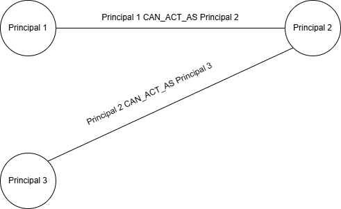

# Transitive Trust Chain Abuse (Graph)

## 1. Principaux

Les niveaux de privilèges (base, intermédiaire, critique) sont donnés à titre illustratif et ne constituent pas une typologie fixe des principaux.

Nous retrouvons, dans cet exemple, 3 principaux. 
- Principal 1 : droits de base
- Principal 2 : droits intermédiaires
- Principal 3 : droits critiques

## 2. Actions

Chaque arête à une action : CAN_ACT_AS.

L’arête CAN_ACT_AS représente une relation de délégation ou d’impersonation permettant à un principal source d’agir avec les privilèges effectifs du principal cible.

Etant donné que le principal 2 peut effectuer les actions du principal 3, cela signifie que, un attaquant ayant le contrôle de principal 1, peut abuser et devenir principal 3 par l'intermédiaire du principal 2.

Cette situation constitue une Transitive Trust Chain Abuse, car l’accès au principal 3 est rendu possible uniquement par la composition de relations de confiance légitimes, sans qu’aucun lien direct n’existe entre le principal 1 et le principal 3.

## 3. Capability

Une Capability représente une capacité ou un pouvoir critique dans le système IAM.  
Elle ne correspond pas à une ressource technique spécifique, mais à une frontière de risque du point de vue de la sécurité.

Exemples de capabilities :
- Administration globale
- Gestion des identités et des accès (IAM)
- Accès à des secrets sensibles
- Désactivation ou altération des mécanismes de journalisation

Les capabilities sont utilisées pour qualifier l’impact potentiel d’un chemin de confiance.  
Une escalade est considérée comme critique lorsqu’un principal initialement peu privilégié peut atteindre, par transitivité, une capability sensible.

## 4. Relations supplémentaires

En complément de la relation **CAN_ACT_AS**, le modèle introduit la relation suivante :

- **HAS_CAPABILITY (Principal → Capability)**  
  Cette relation indique qu’un principal possède directement une capability donnée.

La détection d’une Transitive Trust Chain Abuse repose sur l’identification d’un chemin reliant un principal contrôlé par un attaquant à une capability critique, via une ou plusieurs relations CAN_ACT_AS.

------------------------------------------------------------

Dans l’exemple précédent, le principal 3 possède une capability critique.  
Ainsi, bien qu’aucun lien direct n’existe entre le principal 1 et cette capability, celle-ci devient atteignable par transitivité via le principal 2.

Ce chemin constitue une Transitive Trust Chain Abuse.

## Règle de détection TTCA

Une Transitive Trust Chain Abuse est détectée lorsqu’il existe un chemin dans le graphe satisfaisant les conditions suivantes :

1. Le chemin commence par un **principal contrôlé par l’attaquant**.
2. Le chemin contient **au moins deux relations CAN_ACT_AS consécutives** entre des principaux distincts.
3. Le chemin se termine par une relation **HAS_CAPABILITY** vers une **capability critique**.
4. Aucune relation directe n’existe entre le principal initial et la capability finale.

Formellement, un chemin de la forme :

Principal₀  
→ CAN_ACT_AS → Principal₁  
→ CAN_ACT_AS → …  
→ CAN_ACT_AS → Principalₙ  
→ HAS_CAPABILITY → Capability_critique  

avec **n ≥ 1**, constitue une TTCA.

Un chemin ne constitue pas une TTCA si le principal initial possède déjà directement la capability critique, ou si une relation directe et explicite existe entre le principal initial et cette capability.
